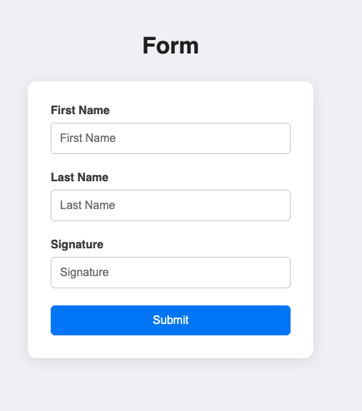

# Task for creating a React Hook Form

- Create a new form with three fields: FirstName, LastName and Consent Signature
1. First Name and Last Name are required fields and it can hold special characters, and has the following validations
  - Space cannot be first letter
  - Space cannot be last letter
  - Min length should be 2 characters
  - Space cannot be the only letters
  - Should contain letters and spaces
  - First letter should be capital case
2. Consent Signature field is required with the following validations
  - Should accept whatever the first three characters of the first name is
  - Should match complete last name. 
  - Should be case insensitive

# Screenshot

